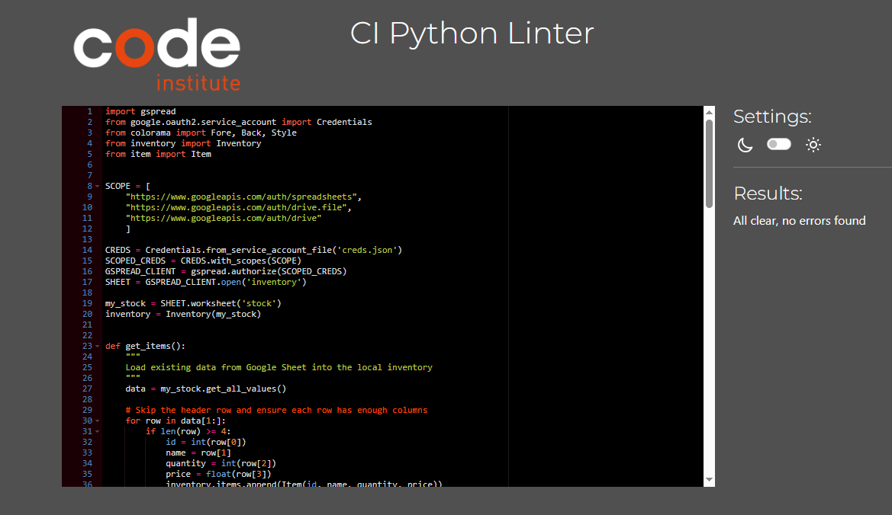
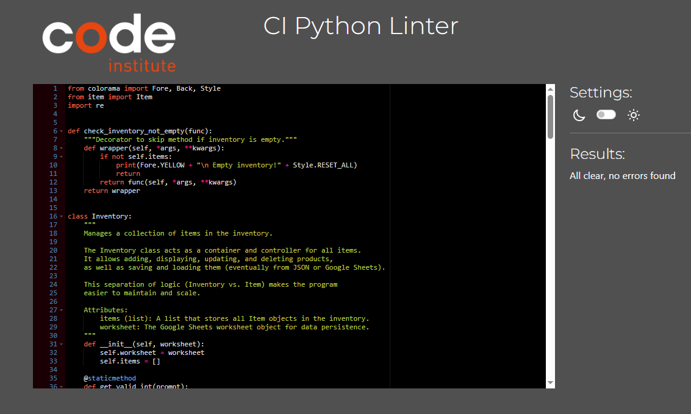

# [my_inventory_manager](https://my-inventory-manager-17f3f6d5a838.herokuapp.com)

Developer: Chahinez Boutemine ([Scaphix](https://www.github.com/Scaphix))

[](https://www.github.com/Scaphix/my_inventory_manager/commits/main)
[](https://www.github.com/Scaphix/my_inventory_manager/commits/main)
[](https://www.github.com/Scaphix/my_inventory_manager)
[](https://my-inventory-manager-17f3f6d5a838.herokuapp.com)

The Inventory Management Tool is a simple, Python-based command-line application designed to help small businesses keep track of their stock efficiently. It allows users to add, update, delete, and display items with clear, color-coded feedback in the terminal. The idea for this project came from my own experience working in my family’s business, where I realized we lacked an organized way to manage inventory. I always wanted to create a tool that could make this process easier, and learning Python gave me the opportunity to finally build it myself.


## UX


**Purpose**
- Provide users with a simple and effective way to track inventory levels and manage products directly from the terminal.
- Help small business owners maintain accurate records of their stock, reduce manual errors, and make informed decisions about restocking or pricing.
- Offer a practical learning experience for understanding how programming concepts can be applied to real-world business problems.

**Primary User Needs**
- Easily add, update, delete, and view items in the inventory.
- Keep track of product quantities and prices with minimal technical knowledge.
- Store data safely for later use, with the option to extend the system to save data to a file or connect to Google Sheets.
- Receive clear and user-friendly feedback through color-coded messages in the terminal.

**Business Goals**
- Offer a lightweight, reliable, and cost-free tool to manage inventory without requiring advanced software.
- Help businesses save time, avoid stock shortages or overstocking, and maintain up-to-date records.
- Support better organization and customer satisfaction by ensuring that stock information is always accurate and easy to access.


## Wireframes

To follow best practice, a flowchart was created to showcase the progression of the Python app.
I've used [Lucidchart](https://www.lucidchart.com/pages/examples/flowchart-maker) to design my app flowchart.


## User Stories


| Target    | Expectation                                                                 | Outcome                                                                                |
| ----------- | ----------------------------------------------------------------------------- | ---------------------------------------------------------------------------------------- |
| As a user | I would like to add new items to my inventory with unique IDs and names     | so that I can track each product individually without confusion.                       |
| As a user | I would like to update existing items (name, quantity, price)               | so that I can keep my inventory information current as stock levels and prices change. |
| As a user | I would like to delete items from my inventory with a confirmation prompt   | so that I can remove discontinued products while avoiding accidental deletions.        |
| As a user | I would like to view all items in a sorted, formatted table                 | so that I can easily see my complete inventory at a glance.                            |
| As a user | I would like the application to validate my input (IDs, quantities, prices) | so that I don't accidentally enter invalid data that could corrupt my records.         |
| As a user | I would like to see color-coded feedback for success, errors, and warnings  | so that I can quickly understand the results of my actions.                            |
| As a user | I would like the app to prevent duplicate IDs and names                     | so that each item in my inventory is unique and identifiable.                          |
| As a user | I would like the app to be intuitive with a clear menu system               | so that I can manage my inventory without needing extensive training.                  |

## Features

### Existing Features


| Feature               | Notes                                                                                                                                                                     | Screenshot                                                 |
| ----------------------- | --------------------------------------------------------------------------------------------------------------------------------------------------------------------------- | ------------------------------------------------------------ |
| Add Item              | Users can add new items with unique ID and name validation. The system ensures no duplicate IDs or names exist and validates quantity (integer) and price (float) inputs. |          |
| Update Item           | Allows users to modify existing items by ID, updating the name, quantity, and price. Validates all inputs and confirms updates with success messages.                     |       |
| Display Items         | Shows all inventory items in a formatted table sorted by ID, displaying ID, name, quantity, and price in a clear, color-coded layout.                                     |     |
| Delete Item           | Removes items from inventory by ID with a confirmation prompt (y/n) to prevent accidental deletion. Handles invalid responses gracefully.                                 |       |
| Input Validation      | Validates integer inputs (ID, quantity) and float inputs (price) with retry prompts. Ensures data integrity by rejecting invalid entries with clear error messages.       |  |
| Color-coded Feedback  | Uses colorama to provide visual feedback: green for success, red for errors, yellow for warnings, blue for menu headers, and magenta for section headers.                 |    |
| Empty Inventory Check | Decorator pattern prevents update and delete operations on empty inventory, displaying a friendly warning message instead.                                                |       |
| Menu System           | Interactive menu-driven interface with 5 options (Add, Update, Display, Delete, Exit) that loops until the user chooses to exit.                                          |       |

### Future Features

- **User Authentication and Role Management**: Implement a login system with roles (e.g., admin, employee) to restrict data access based on user roles.
- **Data Persistence**: Save inventory data to JSON files or connect to Google Sheets for persistent storage across sessions.
- **Data Visualization**: Add charts and graphs to visually represent stock levels, value trends, and inventory metrics over time.
- **Search and Filter**: Implement search functionality to find items by name, ID range, or price range, with filtering options.
- **Low Stock Alerts**: Notify users when stock levels fall below a defined threshold, prompting restock orders.
- **Bulk Operations**: Add ability to import/export multiple items at once via CSV files.
- **Transaction History**: Track all add/update/delete operations with timestamps for audit trails.
- **Reporting and Exporting**: Generate and export detailed inventory reports in PDF or CSV format.
- **Category Management**: Organize items into categories (e.g., electronics, food, clothing) for better organization.
- **Mobile App Integration**: Develop a mobile version of the app for easier inventory management on the go.
- **Multi-location Support**: Extend the system to track inventory across multiple warehouse or store locations.
- **Price History**: Track price changes over time to analyze pricing trends and profitability.


## Tools & Technologies

| Tool / Tech | Use |
| --- | --- |
| [](https://markdown.2bn.dev) | Generate README and TESTING templates. |
| [](https://git-scm.com) | Version control. (`git add`, `git commit`, `git push`) |
| [](https://github.com) | Secure online code storage. |
| [](https://code.visualstudio.com) | Local IDE for development. |
| [](https://www.python.org) | Back-end programming language. |
| [](https://www.heroku.com) | Hosting the deployed back-end site. |
| [](https://chat.openai.com) | Help debug, troubleshoot, and explain things. |
| [](https://www.lucidchart.com) | Flow diagrams for mapping the app's logic. |
| [](https://stackoverflow.com) | Troubleshooting and Debugging |


## Database Design

### Data Model

#### Flowchart


#### Classes & Functions


To make the Inventory Management Tool more organised and scalable, I chose to implement an object-oriented structure using two main classes: Item and Inventory. The Item class represents individual products, each with its own attributes such as ID, name, quantity, and price. The Inventory class, on the other hand, manages a collection of these items and provides the functionality to add, display, update, or delete products.

By separating responsibilities, the Item class handles individual product data, while the Inventory class manages the overall collection and business logic.
This object-oriented approach allows me to extend the project later (e.g., connecting to a Google Sheet, adding invoices, or tracking quantities automatically) without rewriting the core functions


```python
class Item:
    """
    Represents a single product or entry in the inventory.

    The Item class is responsible for storing all the details about
    an individual product such as its ID, name, quantity, and price.
    It ensures that each item can be easily managed, updated, and displayed
    as part of the overall inventory.

    Attributes:
        id (str): A unique identifier for the item.
        name (str): The name of the product.
        quantity (int): The available stock quantity.
        price (float): The price per unit of the product.
    
    """
    def __init__(self, id, name, quantity, price):
        self.id = id
        self.name = name
        self.quantity = quantity
        self.price = price
```


```python
class Inventory:
    """
    Manages a collection of items in the inventory.

    The Inventory class acts as a container and controller for all items.
    It allows adding, displaying, updating, and deleting products,
    as well as saving and loading them (eventually from JSON or Google Sheets).

    This separation of logic (Inventory vs. Item) makes the program
    easier to maintain and scale.

    Attributes:
        items (list): A list that stores all Item objects in the inventory.
    """
    def __init__(self):
        self.items = []
```

The primary functions used on this application are:

- `add_item()`
  - Prompts user for item details (ID, name, quantity, price) and adds a new Item object to the inventory list.
- `update_item()`
  - Allows user to modify an existing item's name, quantity, and price by searching for it by ID.
- `delete_item(id)`
  - Removes an item from the inventory by ID after user confirmation (y/n prompt).
- `display_item()`
  - Displays all items in a formatted table sorted by ID, showing ID, name, quantity, and price.
- `get_valid_int(prompt)`
  - Static method that validates and returns integer input, re-prompting on invalid entries.
- `get_valid_float(prompt)`
  - Static method that validates and returns float input for price values.
- `get_id()`
  - Gets a unique item ID from the user, checking for duplicates in the existing inventory.
- `get_name()`
  - Gets a unique item name from the user, checking for duplicates (case-insensitive).
- `check_inventory_not_empty()`
  - Decorator function that prevents operations on empty inventory and displays a warning.
- `tasks_list()`
  - Displays the main menu and handles user task selection in a loop until exit.
- `my_task(selected_task)`
  - Executes the selected task (1-5) by calling the appropriate inventory method.

#### Imports

I've used the following Python packages and external imports.

- `colorama`: used for including color in the terminal (Fore, Back, Style)
- `item`: local module containing the Item class definition
- `inventory`: local module containing the Inventory class and inventory management logic

## Agile Development Process

### GitHub Projects


[GitHub Projects](https://www.github.com/Scaphix/my_inventory_manager/projects) served as an Agile tool for this project. Through it, EPICs, User Stories, issues/bugs, and Milestone tasks were planned, then subsequently tracked on a regular basis using the Kanban project board.


### Must Have (MVP)
- [As a user, I want to search for a title so that I can find relevant information.](https://github.com/larevolucia/reeltracker_cli/issues/3)


### GitHub Issues

[GitHub Issues](https://www.github.com/Scaphix/my_inventory_manager/issues) served as an another Agile tool. There, I managed my User Stories and Milestone tasks, and tracked any issues/bugs.

| Link | Screenshot |
| --- | --- |
| [](https://www.github.com/Scaphix/my_inventory_manager/issues?q=is%3Aissue%20is%3Aopen%20-label%3Abug) |  |
| [](https://www.github.com/Scaphix/my_inventory_manager/issues?q=is%3Aissue%20is%3Aclosed%20-label%3Abug) |  |

### MoSCoW Prioritization

I've decomposed my Epics into User Stories for prioritizing and implementing them. Using this approach, I was able to apply "MoSCoW" prioritization and labels to my User Stories within the Issues tab.

- **Must Have**: guaranteed to be delivered - required to Pass the project (*max ~60% of stories*)
- **Should Have**: adds significant value, but not vital (*~20% of stories*)
- **Could Have**: has small impact if left out (*the rest ~20% of stories*)
- **Won't Have**: not a priority for this iteration - future features

## Testing

## Code Validation

I have used the recommended [PEP8 CI Python Linter](https://pep8ci.herokuapp.com) to validate all of my Python files.


The final results are as follows:


| File  | Screenshot | Notes |
| ---  | --- | --- |
| [run.py](https://github.com/Scaphix/my_inventory_manager/blob/main/run.py) |   | No errors found |
| [inventory.py](https://github.com/Scaphix/my_inventory_manager/blob/main/inventory.py) |   | No errors found |
| [item.py](https://github.com/Scaphix/my_inventory_manager/blob/main/item.py) |   | No errors found |


## Bugs

**Bug 1**:
 

**Description**: I deployed the project to Heroku without including all required dependencies in the requirements.txt file. This caused an error where Heroku could not recognize the module. 

**Correction**: I added the missing dependencies to fix the deployment issue.


**Bug 2**:

 

**Description**: I called a method without passing any argument.

```python
    elif selected_task == "4":

        inventory.delete_item()
```
**Correction**:

```python
    elif selected_task == "4":

        name_to_delete = input(" Enter Name: ").strip()

        inventory.delete_item(name_to_delete)
```

**Bug 3**:

**Description**: The delete function was comparing string input with integer IDs, causing items to not be found. When adding items, IDs were stored as integers via `get_valid_int()`, but the delete function accepted input as a string without conversion.

**Correction**: Added type conversion in the delete task handler:

```python
    elif selected_task == "4":
        print("Please enter the id of the item to delete ")
        try:
            id_to_delete = int(input("Enter Id: ").strip())
            inventory.delete_item(id_to_delete)
        except ValueError:
            print(Fore.RED + "Invalid ID! Please enter a number.")
            print(Style.RESET_ALL)
```

**Bug 4**:

**Description**: When a user entered an invalid response (anything other than 'y' or 'n') at the delete confirmation prompt, the code did not return from the function. It would fall through the conditional and print "not found" even though the item was found.

**Correction**: Added an else clause to handle invalid confirmation input:

```python
    if delete == "y":
        self.items.remove(item)
        print(Fore.GREEN + f" item {id} deleted successfully.")
        print(Style.RESET_ALL)
        return
    elif delete == "n":
        print(Fore.YELLOW + " Deletion cancelled.")
        print(Style.RESET_ALL)
        return
    else:
        print(Fore.RED + " Invalid input. Deletion cancelled.")
        print(Style.RESET_ALL)
        return
```

## Deployment

Code Institute has provided a [template](https://github.com/Code-Institute-Org/python-essentials-template) to display the terminal view of this backend application in a modern web browser. This is to improve the accessibility of the project to others.

The live deployed application can be found deployed on [Heroku](https://my-inventory-manager-17f3f6d5a838.herokuapp.com).

### Heroku Deployment

This project uses [Heroku](https://www.heroku.com), a platform as a service (PaaS) that enables developers to build, run, and operate applications entirely in the cloud.

Deployment steps are as follows, after account setup:

- Select **New** in the top-right corner of your Heroku Dashboard, and select **Create new app** from the dropdown menu.
- Your app name must be unique, and then choose a region closest to you (EU or USA), then finally, click **Create App**.
- From the new app **Settings**, click **Reveal Config Vars**, and set the value of **KEY** to `PORT`, and the **VALUE** to `8000` then select **ADD**.
- If using any confidential credentials, such as **CREDS.JSON**, then these should be pasted in the Config Variables as well.
- Further down, to support dependencies, select **Add Buildpack**.
- The order of the buildpacks is important; select `Python` first, then `Node.js` second. (if they are not in this order, you can drag them to rearrange them)

Heroku needs some additional files in order to deploy properly.

- [requirements.txt](requirements.txt)
- [Procfile](Procfile)
- [.python-version](.python-version)

You can install this project's **[requirements.txt](requirements.txt)** (*where applicable*) using:

- `pip3 install -r requirements.txt`

If you have your own packages that have been installed, then the requirements file needs updated using:

- `pip3 freeze --local > requirements.txt`

The **[Procfile](Procfile)** can be created with the following command:

- `echo web: node index.js > Procfile`

The **[.python-version](.python-version)** file tells Heroku the specific version of Python to use when running your application.

- `3.12` (or similar)

For Heroku deployment, follow these steps to connect your own GitHub repository to the newly created app:

Either (*recommended*):

- Select **Automatic Deployment** from the Heroku app.

Or:

- In the Terminal/CLI, connect to Heroku using this command: `heroku login -i`
- Set the remote for Heroku: `heroku git:remote -a app_name` (*replace `app_name` with your app name*)
- After performing the standard Git `add`, `commit`, and `push` to GitHub, you can now type:
	- `git push heroku main`

The Python terminal window should now be connected and deployed to Heroku!


### Local Development

This project can be cloned or forked in order to make a local copy on your own system.

For either method, you will need to install any applicable packages found within the [requirements.txt](requirements.txt) file.

- `pip3 install -r requirements.txt`.

If using any confidential credentials, such as `CREDS.json` or `env.py` data, these will need to be manually added to your own newly created project as well.

#### Cloning

You can clone the repository by following these steps:

1. Go to the [GitHub repository](https://www.github.com/Scaphix/my_inventory_manager).
2. Locate and click on the green "Code" button at the very top, above the commits and files.
3. Select whether you prefer to clone using "HTTPS", "SSH", or "GitHub CLI", and click the "copy" button to copy the URL to your clipboard.
4. Open "Git Bash" or "Terminal".
5. Change the current working directory to the location where you want the cloned directory.
6. In your IDE Terminal, type the following command to clone the repository:
	- `git clone https://www.github.com/Scaphix/my_inventory_manager.git`
7. Press "Enter" to create your local clone.


#### Forking

By forking the GitHub Repository, you make a copy of the original repository on our GitHub account to view and/or make changes without affecting the original owner's repository. You can fork this repository by using the following steps:

1. Log in to GitHub and locate the [GitHub Repository](https://www.github.com/Scaphix/my_inventory_manager).
2. At the top of the Repository, just below the "Settings" button on the menu, locate and click the "Fork" Button.
3. Once clicked, you should now have a copy of the original repository in your own GitHub account!


## Credits


### Content


| Source | Notes |
| --- | --- |
| [Markdown Builder](https://markdown.2bn.dev) | Help generating Markdown files |
| [Chris Beams](https://chris.beams.io/posts/git-commit) | "How to Write a Git Commit Message" |
| [Love Sandwiches](https://codeinstitute.net) | Code Institute walkthrough project inspiration |
| [Real Python](https://realpython.com/python-quiz-application) | Inspiration for a quiz app |
| [BroCode](https://www.youtube.com/watch?v=ag8NtD1e0Kc) | Inspiration for hangman game |
| [Python Tutor](https://pythontutor.com) | Additional Python help |
| [Colorama](https://www.youtube.com/watch?v=u51Zjlnui4Y) | Adding color in Python |
| [StackOverflow](https://stackoverflow.com/a/50921841) | Clear screen in Python |
| [ChatGPT](https://chatgpt.com) | Help with code logic and explanations |

### Photo

[Layout image](https://www.veeqo.com/gb/blog/inventory-shrinkage)

### Media

| Source | Notes |
| --- | --- |
| [ASCII Art Archive](https://www.asciiart.eu) | Pre-defined ASCII art |
| [TEXT-IMAGE](https://www.text-image.com) | Converting an image to ASCII art |
| [Patorjk](https://patorjk.com/software/taag) | Converting text to ASCII art |

### Acknowledgements

- I would like to thank my Code Institute mentor, [Tim Nelson](https://www.github.com/TravelTimN) for the support throughout the development of this project.
- I would like to thank the [Code Institute](https://codeinstitute.net) Tutor Team for their assistance with troubleshooting and debugging some project issues.
- I would like to thank my partner, for believing in me, and allowing me to make this transition into software development.